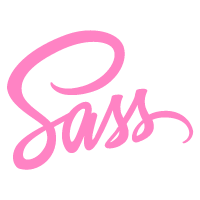

## Hi there, I'm Cha 👋

#### :raised_hand: About Me

- 🌟 Motto: Nothing is impossible for a willing heart.
- 🌱 Hobby: Coding & Piano & 🏀 &  🏊‍♂️ & 🏸 & 🚴‍♂️ & 🎤 & etc.
- 🏡 Hometown: China
- 🏢 Office: California
- ⚡ Fun fact: Oops!😝😝😝
- 😊 Nice to meet you!

#### 🛠 Languages and Tools  

  <code></code>
  <code></code>
  <code></code>
  <code></code>
  <code></code>
  <code></code>
  <code></code>
  <code></code>
  <code></code>
  <code></code>
  <code></code>
  <code></code>
  <code></code>
  <code></code>

  
#### :trophy: Coding Info

  
  

